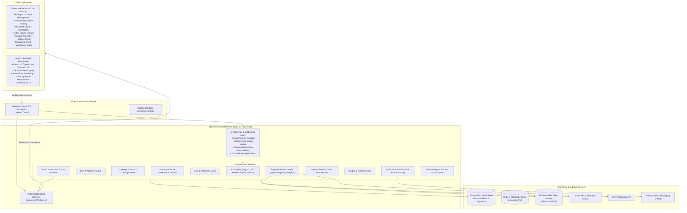

# FreshCart Architecture & System Design

## 1. High-Level System Architecture

FreshCart is architected as an event-aware modular monolith designed to deliver sub-100ms API response times, reliable inventory isolation, resilient payment reconciliation, and sub-second push/real-time synchronization to mobile customers and administrative staff.



---

## 2. Directory & Monorepo Layout

```
grocery-platform/
├── .github/
│   └── workflows/
│       ├── backend-ci.yml              # CI/CD: lint, test, docker build for NestJS
│       ├── admin-ci.yml                # CI/CD: lint, build Next.js admin dashboard
│       └── mobile-ci.yml               # CI/CD: flutter analyze, flutter test
├── backend/
│   ├── src/
│   │   ├── auth/                       # JWT, refresh tokens, guards, decorators
│   │   ├── users/                      # User entity, profile, address management
│   │   ├── categories/                 # Category hierarchy, slugs, media
│   │   ├── products/                   # Catalog, pricing, units, filtering
│   │   ├── inventory/                  # Stock levels, audit logs, thresholds
│   │   ├── cart/                       # User cart, session items, totals
│   │   ├── checkout/                   # Pre-order validation, reservation TTL
│   │   ├── orders/                     # Order lifecycle, state machine, transitions
│   │   ├── payments/                   # Stripe, PayPal, webhooks, verification
│   │   ├── delivery/                   # Geofenced zones, delivery slots, pickup
│   │   ├── coupons/                    # Promo codes, validation rules, usage limits
│   │   ├── reviews/                    # Ratings, product reviews
│   │   ├── wishlist/                   # User saved products
│   │   ├── notifications/              # Firebase Cloud Messaging, in-app alerts
│   │   ├── admin/                      # Admin analytics, operations, audit logs
│   │   ├── common/                     # Filters, pipes, interceptors, prisma service
│   │   ├── app.module.ts
│   │   └── main.ts
│   ├── prisma/
│   │   ├── schema.prisma               # Complete PostgreSQL relational schema
│   │   ├── migrations/                 # Versioned migration history
│   │   └── seed.ts                     # Initial categories, products, admin user
│   ├── test/                           # E2E & integration test suites
│   ├── Dockerfile
│   ├── .env.example
│   ├── tsconfig.json
│   └── package.json
├── admin/
│   ├── src/
│   │   ├── app/                        # Next.js 15 App Router pages & layouts
│   │   │   ├── (auth)/login/
│   │   │   ├── (dashboard)/
│   │   │   │   ├── page.tsx            # Executive KPI Dashboard
│   │   │   │   ├── orders/             # Order management & status progression
│   │   │   │   ├── products/           # Catalog management & image upload
│   │   │   │   ├── categories/         # Category hierarchy
│   │   │   │   ├── inventory/          # Stock adjustment & alerts
│   │   │   │   ├── customers/          # Customer listing & order history
│   │   │   │   ├── coupons/            # Promotions & discount rules
│   │   │   │   ├── delivery/           # Delivery zones & slots
│   │   │   │   └── settings/           # Store configuration
│   │   ├── components/                 # Reusable UI components (tables, badges, modals)
│   │   ├── hooks/                      # Custom React query hooks
│   │   ├── lib/                        # Axios instance, formatting, auth tokens
│   │   └── types/                      # TypeScript DTO interfaces
│   ├── public/                         # Static assets & brand icons
│   ├── Dockerfile
│   ├── .env.example
│   ├── tailwind.config.js
│   └── package.json
├── mobile/
│   ├── lib/
│   │   ├── core/                       # Network, storage, theme, utils, errors
│   │   ├── routing/                    # GoRouter route hierarchy & redirects
│   │   ├── services/                   # FCM, WebSocket, Secure Storage, Stripe SDK
│   │   ├── features/                   # Clean Architecture feature modules
│   │   │   ├── auth/                   # Splash, Login, Register, Password Reset
│   │   │   ├── home/                   # Banners, Categories, Recommended
│   │   │   ├── products/               # Filter, Sort, Product Detail, Search
│   │   │   ├── cart/                   # Cart listing, quantities, bill breakdown
│   │   │   ├── checkout/               # Addresses, delivery slots, payment options
│   │   │   ├── orders/                 # Live tracking, details, order history
│   │   │   ├── profile/                # User details, addresses, preferences
│   │   │   └── notifications/          # Notification inbox & preferences
│   │   ├── shared/                     # Common widgets (buttons, inputs, cards)
│   │   └── main.dart
│   ├── android/
│   ├── ios/
│   ├── test/
│   └── pubspec.yaml
├── infrastructure/
│   ├── docker/
│   │   └── postgres/init.sql
│   ├── docker-compose.yml              # Local development stack
│   └── docker-compose.prod.yml         # Production container stack
├── docs/                               # System specifications & guidelines
└── README.md
```

---

## 3. Technology Stack & Architectural Decision Records (ADR)

| Layer | Selected Technology | Architectural Rationale |
|---|---|---|
| **Mobile Framework** | Flutter (Dart 3.x) | Single codebase for iOS and Android with native 60/120fps performance, comprehensive widget ecosystem, and reliable hardware integration (Apple Pay, Google Pay, Biometrics). |
| **Mobile State** | Riverpod 2.x | Compile-time safe, testable dependency injection, reactive state caching without context coupling, and auto-disposal of unused providers. |
| **Mobile Routing** | GoRouter | Declarative routing supporting nested navigation (`ShellRoute`), URL deep linking (for push notifications direct to `/orders/:id`), and authentication redirect guards. |
| **Backend Framework**| NestJS (Node.js 20+) | Modular enterprise architecture with Dependency Injection, first-class TypeScript support, built-in validation pipes, and seamless WebSocket gateway integration. |
| **ORM & Database** | Prisma ORM on PostgreSQL 16 | ACID-compliant relational transactions for financial and inventory consistency, type-safe query generation, migration reproducibility, and indexing performance. |
| **Admin Dashboard** | Next.js 15+ (App Router) | Server-side rendering for snappy load times, rich ecosystem with Tailwind CSS, TypeScript safety, and responsive administration across mobile/tablet/desktop. |
| **Security & Auth** | Argon2id + JWT + Refresh Token Rotation | High-resistance cryptographic hashing against GPU attacks; short-lived access tokens with rotating database-revocable refresh tokens. |
| **Push Notifications**| Firebase Cloud Messaging (FCM)| Industry standard for cross-platform iOS (APNs) and Android push dispatch with device-token lifecycle handling. |
| **Payment Gateways** | Stripe SDK & Webhooks + PayPal | PCI-DSS compliant payment processing with client-side tokenization (Payment Intents) and cryptographically verified server-side webhooks. |
| **Object Storage** | S3-Compatible (MinIO/AWS S3) | High-performance binary asset storage with signed upload URLs, multi-resolution image pipelines, and CDN distribution. |
