# FreshCart Relational Database Design & ERD

## 1. Entity Relationship Diagram (ERD)

```mermaid
erDiagram
    User ||--o{ RefreshToken : "has many"
    User ||--o{ Address : "has many"
    User ||--o{ Order : "places"
    User ||--o{ Cart : "owns"
    User ||--o{ Notification : "receives"
    User ||--o{ Review : "writes"
    User ||--o{ Wishlist : "saves"
    User ||--o{ CouponUsage : "redeems"
    User ||--o{ AdminActionLog : "performs (if admin)"

    Category ||--o{ Category : "sub-category of"
    Category ||--o{ Product : "categorizes"

    Product ||--o{ ProductImage : "has images"
    Product ||--o{ InventoryLog : "tracks stock changes"
    Product ||--o{ CartItem : "in cart items"
    Product ||--o{ OrderItem : "in order items"
    Product ||--o{ Review : "reviewed in"
    Product ||--o{ Wishlist : "saved in"

    Cart ||--o{ CartItem : "contains"

    DeliveryZone ||--o{ Address : "zones coverage"
    DeliveryZone ||--o{ Order : "delivered within"
    DeliverySlot ||--o{ Order : "booked for"

    Order ||--o{ OrderItem : "contains items"
    Order ||--o{ Payment : "funded by"
    Order ||--o{ CouponUsage : "applies discount"
    Order ||--o{ Notification : "triggers"

    Coupon ||--o{ CouponUsage : "recorded in"

    User {
        uuid id PK
        string email UK
        string phone UK
        string passwordHash
        string firstName
        string lastName
        enum role
        boolean isActive
        boolean isEmailVerified
        boolean isPhoneVerified
        string avatarUrl
        datetime createdAt
        datetime updatedAt
        datetime deletedAt
    }

    Address {
        uuid id PK
        uuid userId FK
        string label
        string recipientName
        string phone
        string street
        string apartment
        string city
        string state
        string postalCode
        string country
        float latitude
        float longitude
        boolean isDefault
        string deliveryInstructions
        datetime createdAt
        datetime updatedAt
    }

    DeliveryZone {
        uuid id PK
        string name
        string[] postalCodes
        decimal baseFee
        decimal minOrderAmount
        decimal freeDeliveryThreshold
        int estimatedMinutes
        boolean isActive
        datetime createdAt
        datetime updatedAt
    }

    DeliverySlot {
        uuid id PK
        date slotDate
        time startTime
        time endTime
        int maxCapacity
        int bookedCount
        boolean isActive
        datetime createdAt
    }

    Category {
        uuid id PK
        uuid parentId FK
        string name
        string slug UK
        string description
        string imageUrl
        int sortOrder
        boolean isActive
        datetime createdAt
        datetime updatedAt
    }

    Product {
        uuid id PK
        uuid categoryId FK
        string name
        string slug UK
        string description
        string sku UK
        string barcode UK
        decimal price
        decimal discountPrice
        enum unit
        decimal unitStep
        int stockQuantity
        int minStockThreshold
        boolean isFeatured
        boolean isActive
        datetime createdAt
        datetime updatedAt
        datetime deletedAt
    }

    ProductImage {
        uuid id PK
        uuid productId FK
        string url
        boolean isPrimary
        int sortOrder
        string altText
    }

    InventoryLog {
        uuid id PK
        uuid productId FK
        enum changeType
        int quantityChanged
        int previousQuantity
        int newQuantity
        string reason
        string referenceId
        uuid performedByUserId FK
        datetime createdAt
    }

    Cart {
        uuid id PK
        uuid userId FK
        string sessionToken UK
        datetime createdAt
        datetime updatedAt
    }

    CartItem {
        uuid id PK
        uuid cartId FK
        uuid productId FK
        int quantity
        decimal unitPrice
        datetime createdAt
        datetime updatedAt
    }

    Coupon {
        uuid id PK
        string code UK
        string description
        enum discountType
        decimal discountValue
        decimal minOrderAmount
        decimal maxDiscountAmount
        datetime startDate
        datetime endDate
        int usageLimitTotal
        int usageLimitPerUser
        int timesUsed
        boolean isActive
        datetime createdAt
        datetime updatedAt
    }

    CouponUsage {
        uuid id PK
        uuid couponId FK
        uuid userId FK
        uuid orderId FK
        decimal discountAmount
        datetime usedAt
    }

    Order {
        uuid id PK
        string orderNumber UK
        uuid userId FK
        uuid addressId FK
        uuid deliverySlotId FK
        uuid deliveryZoneId FK
        enum deliveryType
        enum status
        decimal subtotal
        decimal deliveryFee
        decimal discountAmount
        decimal taxAmount
        decimal totalAmount
        string notes
        string cancelReason
        datetime estimatedDeliveryTime
        datetime actualDeliveryTime
        datetime createdAt
        datetime updatedAt
    }

    OrderItem {
        uuid id PK
        uuid orderId FK
        uuid productId FK
        string productName
        string productSku
        decimal unitPrice
        int quantity
        decimal totalPrice
        datetime createdAt
    }

    Payment {
        uuid id PK
        uuid orderId FK
        enum paymentMethod
        enum status
        string transactionId UK
        string paymentIntentId UK
        decimal amount
        string currency
        json metadata
        string failureReason
        datetime paidAt
        datetime createdAt
        datetime updatedAt
    }

    Notification {
        uuid id PK
        uuid userId FK
        string title
        string body
        string type
        json data
        boolean isRead
        datetime createdAt
    }

    Review {
        uuid id PK
        uuid productId FK
        uuid userId FK
        int rating
        string title
        string comment
        boolean isPublished
        datetime createdAt
        datetime updatedAt
    }

    Wishlist {
        uuid id PK
        uuid userId FK
        uuid productId FK
        datetime createdAt
    }

    AdminActionLog {
        uuid id PK
        uuid adminId FK
        string action
        string entity
        string entityId
        json changes
        string ipAddress
        string userAgent
        datetime createdAt
    }
```



---

## 2. PostgreSQL Enumerations

```sql
CREATE TYPE "Role" AS ENUM ('CUSTOMER', 'STORE_MANAGER', 'DISPATCHER', 'ADMIN', 'SUPER_ADMIN');

CREATE TYPE "OrderStatus" AS ENUM (
    'PENDING_PAYMENT',
    'PAID',
    'CONFIRMED',
    'PREPARING',
    'READY_FOR_PICKUP',
    'OUT_FOR_DELIVERY',
    'DELIVERED',
    'CANCELLED',
    'REFUNDED'
);

CREATE TYPE "DeliveryType" AS ENUM ('DELIVERY', 'PICKUP');

CREATE TYPE "PaymentMethod" AS ENUM ('STRIPE', 'APPLE_PAY', 'GOOGLE_PAY', 'PAYPAL', 'CASH_ON_DELIVERY');

CREATE TYPE "PaymentStatus" AS ENUM ('PENDING', 'AUTHORIZED', 'CAPTURED', 'FAILED', 'CANCELLED', 'REFUNDED');

CREATE TYPE "DiscountType" AS ENUM ('PERCENTAGE', 'FIXED');

CREATE TYPE "ProductUnit" AS ENUM ('PIECE', 'KG', 'G', 'LB', 'OZ', 'LITER', 'ML', 'PACK', 'BOX', 'BUNCH');

CREATE TYPE "InventoryChangeType" AS ENUM (
    'PURCHASE_RECEIPT',
    'ORDER_RESERVATION',
    'ORDER_FULFILLMENT',
    'ORDER_CANCELLATION',
    'MANUAL_ADJUSTMENT',
    'WASTAGE_DAMAGE'
);
```

---

## 3. Database Indexes & Performance Optimization

| Table | Index Name | Columns | Type / Rationale |
|---|---|---|---|
| `users` | `idx_users_email` | `email` | Unique B-Tree for fast login lookup |
| `users` | `idx_users_role_status` | `role, isActive` | Compound index for admin role filtering |
| `products` | `idx_products_cat_active` | `categoryId, isActive, isFeatured` | Composite index for category listing & home screen |
| `products` | `idx_products_slug` | `slug` | Unique B-Tree for SEO/canonical product page route |
| `products` | `idx_products_stock_qty` | `stockQuantity, minStockThreshold` | Index for low-stock inventory alerts in admin |
| `orders` | `idx_orders_user_status` | `userId, status, createdAt DESC` | Speed up customer order history listing |
| `orders` | `idx_orders_status_date` | `status, createdAt DESC` | Speed up Admin/Dispatcher queue queries |
| `orders` | `idx_orders_number` | `orderNumber` | Unique lookup for customer search & tracking |
| `cart_items`| `idx_cart_product` | `cartId, productId` | Unique constraint to prevent duplicate item rows |
| `coupons` | `idx_coupon_code_active`| `code, isActive, startDate, endDate` | Compound index for instant coupon validation |
| `payments`| `idx_payment_intent` | `paymentIntentId` | Fast webhook callback matching |
| `admin_action_logs` | `idx_admin_logs_entity` | `entity, entityId, createdAt DESC` | Audit trail traceability |

---

## 4. Soft-Deletion & Concurrency Controls

1. **Soft Deletion**: `User` and `Product` tables implement `deletedAt TIMESTAMP NULL`. All select queries are scoped to `WHERE deletedAt IS NULL` unless explicitly requesting historical records.
2. **Optimistic Locking & Stock Decrement**: Inventory deduction during checkout executes inside an atomic Prisma transaction using row-level locking (`SELECT ... FOR UPDATE` or Prisma's interactive transaction `$transaction([ ... ])`) ensuring zero race conditions during peak flash sales.
