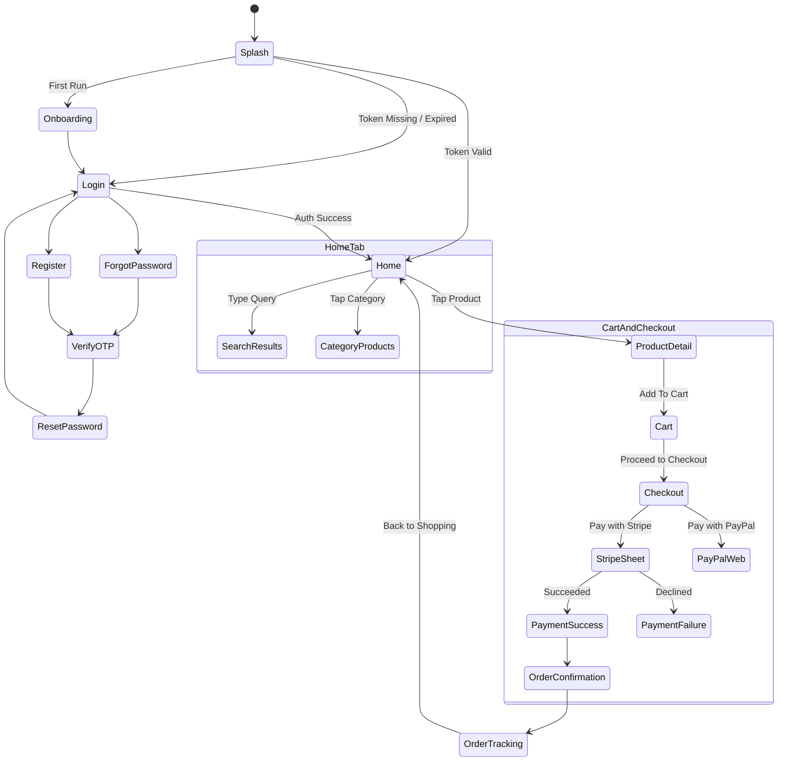

# FreshCart UI Navigation Map & Screen Architecture

## 1. Customer Mobile Application (Flutter)

The mobile application utilizes `GoRouter` with declarative navigation and a persistent bottom navigation bar using `StatefulShellRoute`.

### 1.1 Complete Route Hierarchy

```
/ (Root)
│
├── [Unauthenticated Stack]
│   ├── /splash                      (Brand animation & auth token validation)
│   ├── /onboarding                  (Value proposition carousel for first-time users)
│   ├── /login                       (Email/phone & password login)
│   ├── /register                    (First/last name, email, phone, password)
│   ├── /forgot-password             (Email entry for recovery OTP)
│   ├── /verify-otp                  (6-digit verification code)
│   └── /reset-password              (New password & confirmation)
│
├── [StatefulShellRoute - Persistent Bottom Navigation]
│   │
│   ├── Tab 0: /home
│   │   ├── (Location Selector Modal)
│   │   ├── (Search Autocomplete Modal / Page)
│   │   ├── (Category Quick Chips)
│   │   ├── (Promotional Banner Slider)
│   │   ├── (Popular Products Horizontal List)
│   │   └── (Recommended Products Grid)
│   │
│   ├── Tab 1: /categories
│   │   ├── (Category Grid / Sidebar)
│   │   └── /categories/:slug        (Category products listing with filter sheet)
│   │
│   ├── Tab 2: /cart
│   │   ├── (Cart items with animated quantity incrementors)
│   │   ├── (Coupon code input & instant discount calculation)
│   │   └── (Subtotal, Delivery, Tax, Discount & Total bill breakdown)
│   │
│   ├── Tab 3: /orders
│   │   ├── (Active / Ongoing orders tab)
│   │   └── (Past orders history tab)
│   │
│   └── Tab 4: /profile
│       ├── (User avatar, name, and loyalty status)
│       ├── /profile/edit            (First/last name, phone number, avatar)
│       ├── /profile/addresses       (Saved addresses list)
│       │   └── /profile/addresses/add-edit (Address form with pin-on-map picker)
│       ├── /profile/payment-methods (Saved payment tokens / Apple Pay / Google Pay)
│       ├── /profile/notifications   (In-app notification list & push toggles)
│       ├── /profile/security        (Change password & 2FA)
│       └── (Logout / Account Deletion dialogs)
│
├── [Sub-Routes & Modal Flows]
│   ├── /products/:slug              (Product detail: gallery, unit selector, nutrition, reviews)
│   ├── /checkout
│   │   ├── Step 1: Address selection / Add new address
│   │   ├── Step 2: Delivery window slot or Store pickup
│   │   ├── Step 3: Payment method (Stripe card, Apple Pay, Google Pay, PayPal)
│   │   └── Step 4: Final order review & slide to place order
│   ├── /checkout/payment-status     (Success animation or Failure recovery screen)
│   ├── /orders/:id                  (Order details, items, invoice download)
│   └── /orders/:id/track            (Real-time live map tracking & status stepper)
```

### 1.2 Mobile Screen State Transitions



---

## 2. Web-Based Admin Dashboard (Next.js App Router)

The Admin Dashboard provides role-governed access for Store Managers, Dispatchers, and Platform Administrators.

### 2.1 Route & Layout Hierarchy

```
/ (Admin Root)
│
├── /login                           (Secure email, password & 2FA challenge)
│
└── /(dashboard)/ (Protected Dashboard Layout: Sidebar + Topbar)
    │
    ├── /                            (Executive KPI Dashboard)
    │   ├── KPI Metric Cards: Gross Revenue, Total Orders, Active Users, Low Stock Items
    │   ├── Revenue & Orders Chart (7-day, 30-day, Year-to-date)
    │   ├── Real-time Pending Orders Live Feed
    │   └── Low-Stock Alert Warning Panel
    │
    ├── /orders                      (Order Fulfillment Queue)
    │   ├── Tabbed by Status: All | Pending | Preparing | Ready | Out for Delivery | Delivered
    │   ├── Real-time WebSocket Status Pill Indicators
    │   ├── Order Search & Date Filter
    │   └── /orders/[id]             (Order details drawer, status updater, packing checklist)
    │
    ├── /products                    (Product Catalog Management)
    │   ├── Products Table with Thumbnail, SKU, Price, Stock & Status Badge
    │   ├── /products/new            (Product creation form with S3 image drag-and-drop)
    │   └── /products/[id]/edit      (Product modification & stock override)
    │
    ├── /categories                  (Category Tree & Taxonomy)
    │   ├── Drag-and-drop category sorting & nesting
    │   └── Create / Edit Category Modal with banner upload
    │
    ├── /inventory                   (Warehouse & Stock Control)
    │   ├── Real-time stock level table with color-coded depletion warning
    │   ├── Quick stock adjustment modal (+ / - units with reason logging)
    │   └── Historical inventory audit trail table
    │
    ├── /customers                   (Customer Relationship Management)
    │   ├── Customer Directory (Name, email, phone, registered date, total orders, lifetime spend)
    │   └── /customers/[id]          (Customer profile & full order history)
    │
    ├── /coupons                     (Marketing & Promotions)
    │   ├── Active & Expired campaigns table
    │   └── Create Coupon Modal (code, percentage/fixed, min order, expiry, usage limit)
    │
    ├── /delivery                    (Logistics & Service Zones)
    │   ├── Delivery Zones configuration (Postal codes list, base fee, min order)
    │   └── Delivery Time Slots & hourly vehicle capacity configuration
    │
    ├── /settings                    (Platform Configuration)
    │   ├── Store identity, currency, and business hours
    │   ├── Tax rates and calculation rules
    │   ├── Payment gateway credentials (Stripe / PayPal mode toggles)
    │   └── Push notification templates
    │
    └── /audit-logs                  (Administrative Compliance)
        └── Immutable chronological log of all admin modifications with IP & timestamp
```
